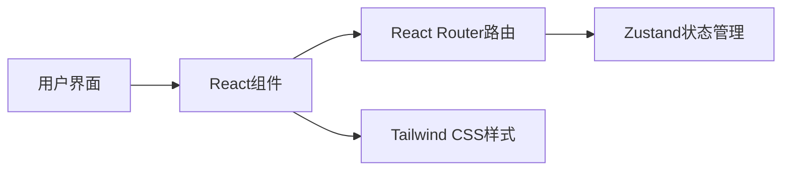

## 1. Architecture Design
纯前端应用架构，使用React作为视图层，React Router处理页面路由，Zustand管理状态。



## 2. Technology Description
- Frontend: React@18 + TypeScript@5 + tailwindcss@3 + vite@5
- Initialization Tool: vite-init
- Routing: react-router-dom@6
- State Management: zustand@4
- Icons: 阿里巴巴图标库

## 3. Route Definitions
| Route | Purpose |
|-------|---------|
| / | 初始页面 - 输入性别和艺名 |
| /story | 剧情页面 - 展示开场剧情 |
| /main | 主界面 - 游戏主界面 |

## 4. Data Model
### 4.1 Game State
```typescript
interface GameState {
  gender: 'male' | 'female' | null;
  stageName: string;
  currentPage: 'start' | 'story' | 'main';
  setGender: (gender: 'male' | 'female') => void;
  setStageName: (name: string) => void;
  setCurrentPage: (page: 'start' | 'story' | 'main') => void;
}
```
