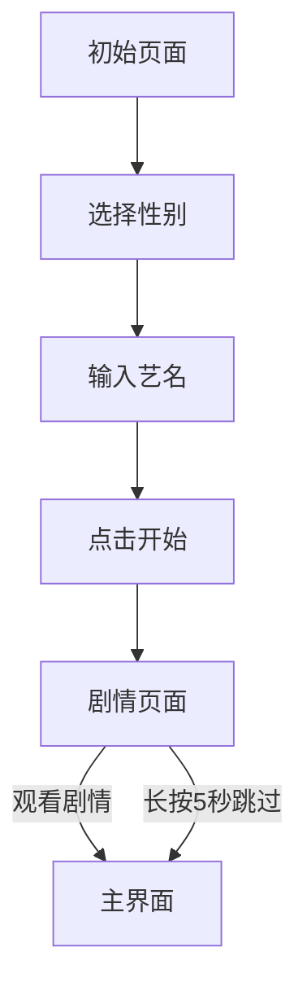

## 1. Product Overview
"铃"是一款剧情向小游戏App，玩家通过输入性别和艺名开始游戏，经历开场剧情后进入主界面。游戏采用红加粉+白渐变色的玻璃液态UI设计风格。

## 2. Core Features

### 2.1 Feature Module
1. **初始页面**: 性别选择、艺名输入、开始按钮
2. **剧情页面**: 开场故事展示、长按跳过功能
3. **主界面**: 核心功能界面、底部悬浮菜单栏

### 2.3 Page Details
| Page Name | Module Name | Feature description |
|-----------|-------------|---------------------|
| 初始页面 | 性别选择 | 提供性别选项供用户选择 |
| 初始页面 | 艺名输入 | 文本输入框，用于输入角色艺名 |
| 剧情页面 | 开场剧情 | 展示游戏开场故事文本 |
| 剧情页面 | 长按跳过 | 长按屏幕5秒可跳过剧情 |
| 主界面 | 底部菜单栏 | 悬浮式导航栏，提供核心功能入口 |

## 3. Core Process
用户打开App → 进入初始页面选择性别、输入艺名 → 开始游戏进入剧情页面 → 观看或跳过开场剧情 → 进入主界面开始游戏

## 4. User Interface Design
### 4.1 Design Style
- Primary colors: 红色(#ff4757)、粉色(#ff6b81)、白色渐变
- Button style: 高圆角、高透明度、玻璃液态效果
- Font: 现代无衬线字体，清晰易读
- Layout style: 卡片式布局，底部悬浮菜单栏
- Icon style: 阿里巴巴图标库图标

### 4.2 Page Design Overview
| Page Name | Module Name | UI Elements |
|-----------|-------------|-------------|
| 初始页面 | 整体布局 | 居中布局，玻璃态卡片，红粉白渐变背景 |
| 剧情页面 | 剧情展示 | 全屏剧情展示，底部进度条，提示长按跳过 |
| 主界面 | 底部导航 | 悬浮式菜单栏，玻璃态效果，高圆角 |

### 4.3 Responsiveness
移动端优先，响应式设计，支持触摸交互
